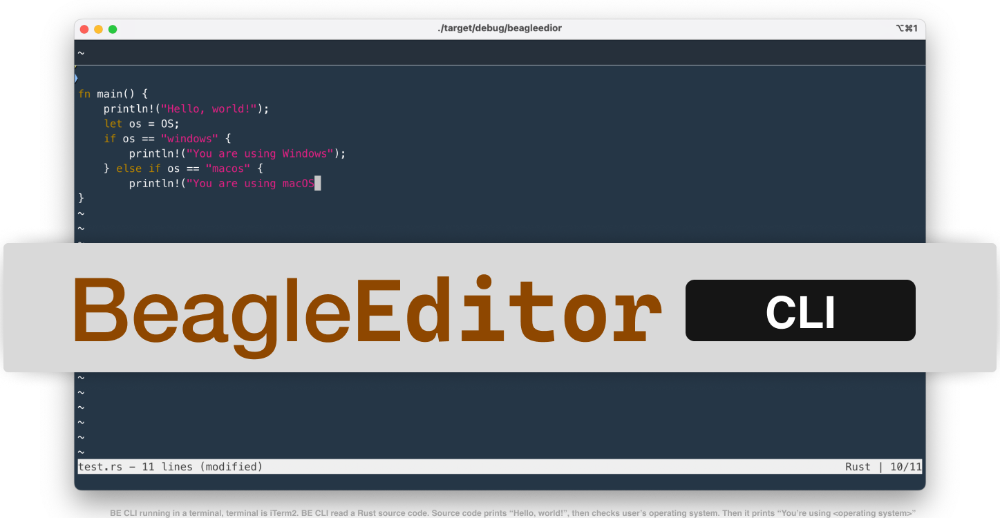

# BeagleEditor CLI
BeagleEditor CLI is back! with memory-safety and performance!

## Installation
### Windows
Not avaliable for Windows yet.

### macOS/Linux
Install it via Cargo:
```shell
cargo install beagleeditor-cli
```

## Keyboard shortcuts

|-------------------|-----------------|
| Keyboard shortcut |     Action      |
|-------------------|-----------------|
|      Ctrl + S     |    Save file    |
|      Ctrl + F     |      Find       |
|      Ctrl + Q     |      Quit       |
|-------------------------------------|
